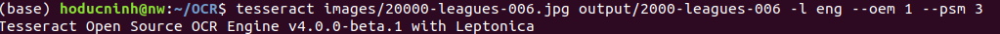

# OCR system

##  Problem Understanding

Build an OCR system which is able to correctly convert an image to text. Testing on the image [here](https://github.com/hoducninh/OCR/blob/master/images/computer-vision.jpg).

## Methodology

Due to the limited time resources and knowledge in building OCR problems, we will be using an open source tool called Tesseract and OpenCV. Tesseract was developed as a proprietary software by Hewlett Packard Labs. In 2005, it was open sourced by HP in collaboration with the University of Nevada, Las Vegas. Since 2006 it has been actively developed by Google and many open source contributors. In the newest version, Tesseract has implemented a Long Short Term Memory (LSTM) based recognition engine.

A good articles about how to get started with Tesseract [here](https://www.pyimagesearch.com/2017/07/10/using-tesseract-ocr-python/).

## Results

After installing all libraries and depedencies for running Tesseract, we use command line going to project directory and type:

(`tesseract images/20000-leagues-006.jpg output/2000-leagues-006 -l eng --oem 1 --psm 3`)

Note that: the input image and output file are stored at (`images/`) and (`output/`) folder respectively. 

From the image input [20000-leagues-006.jpg][https://github.com/hoducninh/OCR/blob/master/images/20000-leagues-006.jpg]. we see that Tesseract does an exellent job with very few mistakes, the output file can be found [here](https://github.com/hoducninh/OCR/blob/master/output/2000-leagues-006.txt).

## Next steps

Despite Tesseract does a really good jobs on the reference image, we might have room for improvements:

1. Dive deep into how Tesseract really works. Some techiniques may be needed to improve the performance of the mode (i.e. image pre-processing).

2. Build an API which allows end-users upload an image and return (`*.txt`) file.

##### Thank you for reading. 

##### Best regards, 

##### Ho Duc Ninh